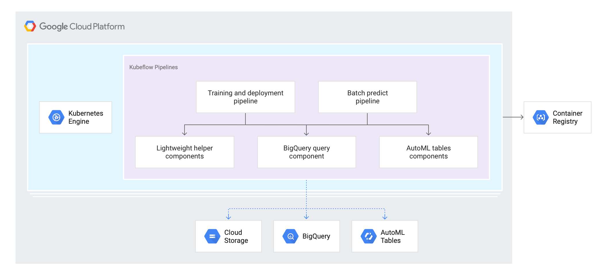

# Predicting Customer Lifetime Value with Kubeflow Pipelines

## Overview

This repository maintains code samples accompanying the **Predicting Customer Lifetime Value with Kubeflow Pipelines** reference guide.

The **Predicting Customer Lifetime Value** reference guide discusses operationalization of Customer Lifetime Value (CLV) modeling techniques described in the [Predicting Customer Lifetime Value with AI Platform](https://cloud.google.com/solutions/machine-learning/clv-prediction-with-offline-training-intro) series of articles, using [Kubeflow Pipelines](https://www.kubeflow.org/docs/pipelines/overview/pipelines-overview/).

The primary goal of the guide is to demonstrate how to orchestrate two Machine Learning workflows:
- The training and deployment of the Customer Lifetime Value predictive model.
- Batch inference using the deployed Customer Lifetime Value predictive model.

## Understanding the design 

The below diagram depicts the high level architecture of the solution:

The core of the solution are two example **Kubeflow Pipelines (KFP)** pipelines:
- Continuous training pipeline, and
- Batch predict pipeline

The pipelines orchestrate Google Cloud [BigQuery](https://cloud.google.com/bigquery) and [AutoML Tables](https://cloud.google.com/automl-tables) services. **BigQuery** is used for data preprocessing and feature engineering and **AutoML Tables** for model training and inference. The pipelines utilize both built-in and custom KFP components.
.

Refer to [README](./pipelines/README.md) in the `/pipelines` folder for more information on the pipeline design and to [README](./components/automl_tables/README.md) in the `/components/automl_components` folder for more information on the custom components utilized by the pipelines.

## Deploying Kubeflow Pipelines

The example pipelines have been developed and tested on [AI Platform Pipelines](https://cloud.google.com/ai-platform/pipelines/docs). 

Refer to [README](./install/README.md) in the `/install` folder  for the instructions on how to deploy and configure an **AI Platform Pipelines** instance.

## Building and deploying the pipelines

The building and deploying of the solution components has been automated using **Cloud Build**. 

Refer to [README](./deploy/README.md) in the `/deploy` folder  for the detailed deployment instructions.

## Running the pipelines

Refer to [README](./run/README.md) in the `/run` folder  for detailed instructions on how to trigger pipeline runs.

## Repository structure

`/pipelines` -The source code for example pipelines.

`/components` - The source code for the custom components used in the pipelines.

`/install` - The environment setup instructions

`/deploy` - Cloud Build configuration for automated building and deployment.

`/run` - Instruction to start pipeline runs.

## Acknowledgements

The sample dataset used in the samples is based on the publicly available [Online Retail Data Set](http://archive.ics.uci.edu/ml/datasets/Online+Retail) from the UCI Machine Learning Repository. 

The original dataset was preprocessed to conform to the the schema used by the solution's pipelines and uploaded to a public GCP bucket as `gs://clv-datasets/transactions/`. 

